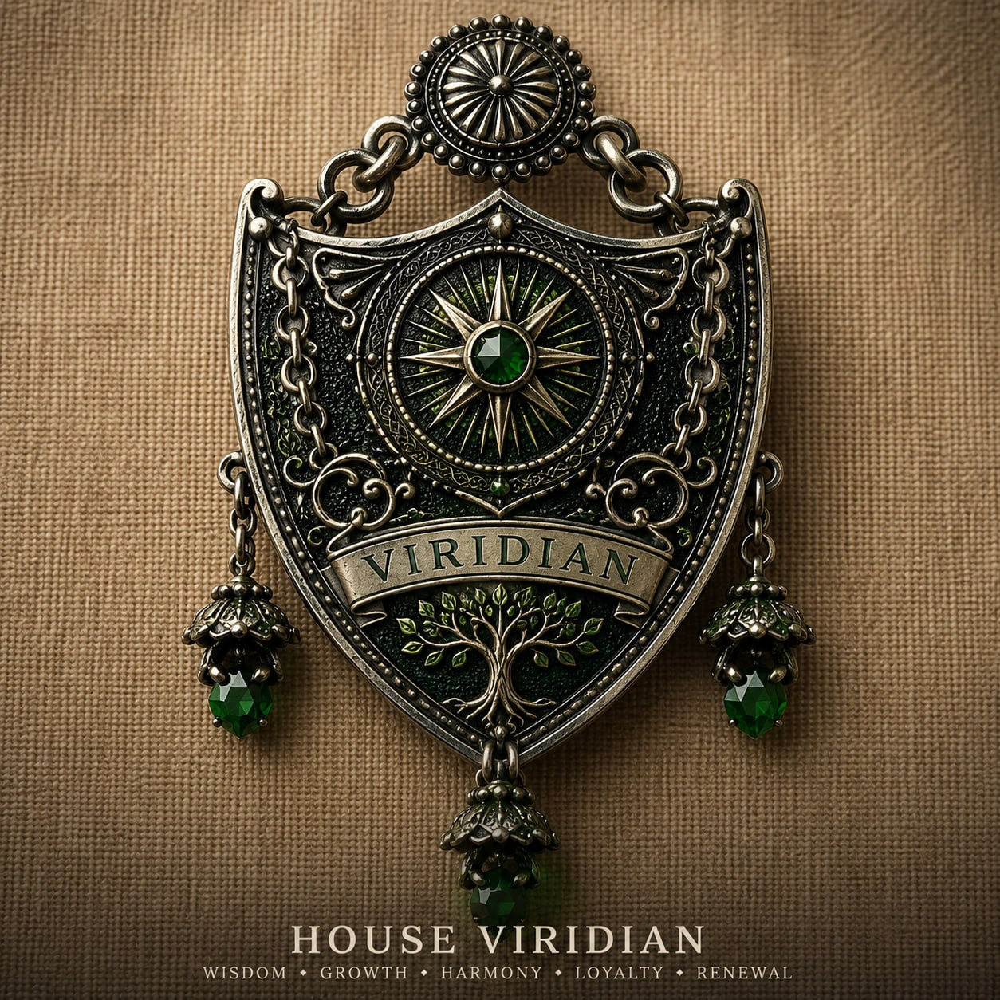

# Epic Fantasy Wiki

Welcome to Epic Fantasy Wiki.

This is a wiki for the high fantasy novel I am writing. The story starts with [[human-civilization|human civilization]] in a very advanced stage. [[characters/Ethal|Ethal]] and [[characters/Prutha|Prutha]] are two scientists from Earth. Other characters in the story include [[characters/Etha|Etha]], [[characters/Wise Man|Wise Man]], and [[characters/Dog|Dog]].

## Start Here

- [[human-civilization|Human Civilization]]
- [[mindland|Mindland]]
- [[characters/index|Characters]]
- [[commonplace-book|Commonplace Book]]
- [[stories/index|Stories]]
- [[arc/index|Arc]]
- [[the-blast-day|The Blast Day]]
- [[tellers-grey-man|Tellers — Grey Man]]
- [[dreamcase|Dreamcase]]

## Human Civilization

Use [[human-civilization|Human Civilization]] as the main page for Earth, its advanced stage of development, institutions, technology, scientific culture, and the starting condition of the story.

Child pages:

- [[organisation-of-human-civilisation|Organisation of Human Civilisation]]
- [[commonplace-book|Commonplace Book]]

## Mindland

Use [[mindland|Mindland]] as the main page for the advanced civilization the story moves toward.

Child pages:

- [[organisation-of-mindland|Organisation of Mindland]]

## Characters

Use [[characters/index|Characters]] as the main character index.

Current character pages:

- [[characters/Dog|Dog]]
- [[characters/Etha|Etha]]
- [[characters/Ethal|Ethal]]
- [[characters/Prutha|Prutha]]
- [[characters/Wise Man|Wise Man]]

## Stories

Written episodes of the novel.

- [[stories/pilot|Pilot]]

## Events

- [[the-blast-day|The Blast Day]]

## Institutions and Groups

- [[commonplace-book|Commonplace Book]]
- [[tellers-grey-man|Tellers — Grey Man]]

## Other Pages

- [[arc/index|Arc]] — story arc, poems
- [[dreamcase|Dreamcase]]

## Wiki Notes

Write pages even when they are incomplete. A short stub with links is useful because it gives future notes somewhere to connect.

Use wikilinks like this:

- `[[Ethal]]` if the page name is unique
- `[[characters/Ethal|Ethal]]` if you want to be exact
- `[[human-civilization|human civilization]]` when the file name is different from the displayed words

Use tags for broad grouping, not for every relationship. Links are better for story-specific relationships.
